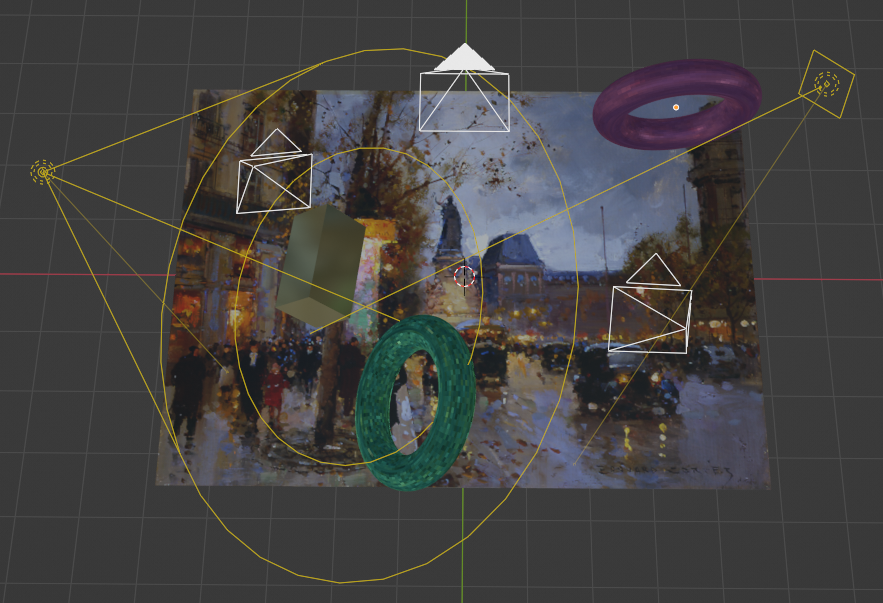

# SIDAR: Synthetic Image Dataset for Alignment & Restoration

Kwiatkowski, M.; Matern, S. and Hellwich, O. (2024). SIDAR: Synthetic Image Dataset for Alignment & Restoration.  In Proceedings of the 19th International Joint Conference on Computer Vision, Imaging and Computer Graphics Theory and Applications - Volume 3: VISAPP, ISBN 978-989-758-679-8, ISSN 2184-4321, pages 175-189. 

arXiv preprint: [https://arxiv.org/abs/2305.12036]  
  
# Dataset

- Fronto-Parallel View: [https://tubcloud.tu-berlin.de/s/55oX7tbXybCF9Be]

# Prerequisites

- Blender 4.x
- Installation of Numpy inside Blender's API

# Running the code

`blender -b --python main.py -- <parameters>`

Show help:  
`blender -b --python main.py -- -h`

Example using default settings:

`blender -b --python main.py -- --src <image-path> --dst <destination directory>`

